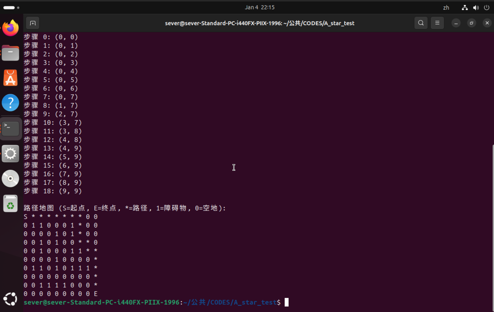

# A* demo (ROS 2 Jazzy + Foxglove)最短路径问题解决程序demo

## 前言
这次离散作业主题是最短路径问题。我接触之初还没学图论，遂查找了一系列如Dijkstra等算法，发现其实实现很简单，并且彼时恰好在  
做机器人导航的相关工作，向相关的人请教之后得知一个常用的算法就是A*，遂打算以A*为例子，并且配合我们使用的ROS环境做个示例,来使得这份工作更具意义。    
然而想法很好，过程相当坎坷。A*的demo早早就完成，但是学习ROS的foxglove等标准导航可视化工具花了挺久，期间很是忙碌，直到现在来不及才堪堪赶完。  
以至于Word都来不及制作，只能以markdown格式表示，多多见谅....(呜呜)
## 问题
最短路径问题，也就是需要寻找一条路径。一般来说这种情况下是存在阻碍，也就是不可达的地点的。否则两点之间直线最短秒了（）  
为了将这个阻碍抽象的表达出来，我们需要一个地图，比如网格状的地图，每个格子表示一个坐标点，其可以表示该坐标格是否可以通行。
与离散数学的联系就在于，这个也是一个图，我们可以把网格视作一个无向图，格就是顶点，格之间可走的路径就是边。这个地图就相当于是一个标注了哪些顶点可达，哪些顶点不可达的矩阵，

## 解决思路
为了解决这个问题，我们需要知道起点和终点，以及我们该如何走。我们知道，如果存在一条最短路径，那么路径上的任何一个点（这个图的子图）到终点很有可能也是最短路径，并且这个点周围的邻接点，除了在最短路径上那个以外，也很有可能会比这个点离终点更远。即，我一直选择当前点距离终点最近的邻居点，然后寻找这个最近邻居点的最近邻居点，这样不断重复，最终很有可能能沿着最近的路到达终点。当然，可能存在两个看起来到终点距离最短的点，甚至更多，这时我们就要将其记录下来，并且分别计算，直到达到终点。当然，这种方法（我后面才知道这叫贪心）不一定是最优解，可能陷入局部最优，甚至可能不能到达终点


此外，地图是有限的，也就是说，只要我们一直走，总能有达到终点的路径。所以，如果我们“懒惰”一点，只走相对于起点来说路程最短的格子，我们就能保证走到最后到了终点。但是这不保证我们肯定走的是最好的路，可能是局部最优解，但是全局来看就不好了。因此还需要遍历每一个点，也就是选一个看起来不是最短点的点，然后继续按照走最短原则执行，对每个可能路径点都计算出这种路径到原始点的距离是多少。显然这样计算量很大，但是确实能走遍每一条路，从而得出最短路径。
A*结合了以上两种，将目前的到起点的值记为代价g，到终点的“直线距离”设为代价h，并且加起来作为代价f，以f作为判断依据进行邻居点的选取。其可能不遍历，只需要到达终点，即可认为目前是最短路径。他需要探索的只有目前已探索的邻居点中f值最小的点，因此大大减少了计算量。
也就是说，A*算法需要知道两个代价，也就是到起点的距离和到终点的距离（g，h），其混合了以上两种思想,能够在速度和可靠性之间做出不错的平衡。

据此，我们需要一个能储存代价的节点（网格）点，并且需要两个数组来储存已探索和准备探索的点。我很少使用c++，但是还是按照c++的风格使用了vector和节点类。以及，我们需要一个计算代价h的方法。我们上面只是假设我们知道距离，但是实际上只能用直线距离估测，（我不是很清楚为什么这个估计值小于等于实际值就可以了）然后这个看起来很高大上的代价函数其实就是求两点之间距离的不同办法。（不能走斜线是因为我这里简化了，其实用欧式距离更直观，但是CPP终端里不太好画）此外还需要一个链表或者堆（其实就是链表的一种形式）用来快速添加和删除节点。这里选用了Cpp自带的堆。然后为了避免遍历邻居节点，使用了标志位确定在哪个列表中。

(示例代码的main部分使用AI生成进行算法验证)
## 代码展示
```"c++"
#include "main.hpp"


class PointNode {
public:
    int x,y;
    float origin_cost;
    float final_cost;
    float total_cost;
    bool Open_flag=false;//是否在open表中
    bool Close_flag=false;//是否在closed表中
    PointNode* parent;//父节点，用来回溯路径

    PointNode(int x, int y, float origin_cost = 0.0, float final_cost = 0.0, PointNode* parent = nullptr)
        : x(x), y(y), origin_cost(origin_cost), final_cost(final_cost), parent(parent) {
            total_cost = origin_cost + final_cost;
        }
private:
    int value;
    
};


/**
 * @brief 小堆比较器
 */
struct MyCompare {
    bool operator()(PointNode* a, PointNode* b) const {
        return a->total_cost > b->total_cost;
    }
};


// 内部函数
float heuristic(const PointNode& a, const PointNode& b) {
    // 使用曼哈顿距离作为启发式函数
    return abs(a.x - b.x) + abs(a.y - b.y);
}
/**
 * @brief 欧几里得距离函数
 * 
 * 
 */

float euclidean_distance(const PointNode& a, const PointNode& b) {
    return std::sqrt(std::pow(a.x - b.x, 2) + std::pow(a.y - b.y, 2));
}


//变量
priority_queue<PointNode*, vector<PointNode*>, MyCompare> openList;//早知道不用堆了，麻烦死了，不能遍历
vector<PointNode*> closedList;//cpp的动态数组
vector<vector<int>> grid; // 网格地图，0表示可通行，1表示障碍物

A_star_params astar_params={
.start_x=0,
.start_y=0,
.goal_x=0,
.goal_y=0

};


/**
 * @brief A*算法主函数
 * 
 */
PointNode A_star_caculate(int origin_x, int origin_y, int target_x, int target_y) {
    PointNode* startNode = new PointNode(origin_x, origin_y);
    PointNode* targetNode = new PointNode(target_x, target_y);

    openList.push(startNode);

    while (!openList.empty()) {
        PointNode* currentNode = openList.top();
        openList.pop();
        closedList.push_back(currentNode);

        // 检查是否到达目标
        if (currentNode->x == targetNode->x && currentNode->y == targetNode->y) {
            return *currentNode; // 找到路径，返回目标节点
        }

        // 生成邻居节点（上下左右四个方向）
        vector<PointNode*> neighbors;
        vector<pair<int, int>> directions = {{0,1}, {1,0}, {0,-1}, {-1,0}};
        for (auto& dir : directions) {
            int newX = currentNode->x + dir.first;
            int newY = currentNode->y + dir.second;

            // 检查边界和障碍物
            if (newX >= 0 && newX < grid.size() && newY >= 0 && newY < grid[0].size() && grid[newX][newY] == 0) {
                PointNode* neighbor = new PointNode(newX, newY);
                neighbors.push_back(neighbor);
            }
        }

        // 处理每个邻居节点
        for (auto& neighbor : neighbors) {
            // 如果邻居在closedList中，跳过
            bool inClosedList = false;
            for (auto& closedNode : closedList) {
                if (neighbor->x == closedNode->x && neighbor->y == closedNode->y) {
                    inClosedList = true;
                    neighbor->Close_flag = true;
                    break;
                }
            }
            if (inClosedList) continue;

            // 计算成本
            float tentative_origin_cost = currentNode->origin_cost + 1.0; // 假设每步代价为1
            float final_cost = heuristic(*neighbor, *targetNode);
            neighbor->origin_cost = tentative_origin_cost;
            neighbor->final_cost = final_cost;
            neighbor->total_cost = tentative_origin_cost + final_cost;
            neighbor->parent = currentNode;

            // 如果邻居不在openList中，加入openList
            if (!neighbor->Open_flag) {
                neighbor->Open_flag = true;
                openList.push(neighbor);
            }
        }
    }
    
    // 没有找到路径
    return PointNode(-1, -1); // 返回无效节点表示失败
}

// 辅助函数：重建路径
vector<pair<int, int>> reconstructPath(PointNode* endNode) {
    vector<pair<int, int>> path;
    PointNode* current = endNode;
    while (current != nullptr) {
        path.push_back({current->x, current->y});
        current = current->parent;
    }
    reverse(path.begin(), path.end());
    return path;
}

// 主函数
#ifndef AS_LIBRARY
int main() {
    // 初始化地图 (10x10的网格)
    grid = {
        {0, 0, 0, 0, 0, 0, 0, 0, 0, 0},
        {0, 1, 1, 0, 0, 0, 1, 0, 0, 0},
        {0, 0, 0, 0, 1, 0, 1, 0, 0, 0},
        {0, 0, 1, 0, 1, 0, 0, 0, 0, 0},
        {0, 0, 1, 0, 0, 0, 1, 1, 0, 0},
        {0, 0, 0, 0, 1, 0, 0, 0, 0, 0},
        {0, 1, 1, 0, 1, 0, 1, 1, 1, 0},
        {0, 0, 0, 0, 0, 0, 0, 0, 0, 0},
        {0, 0, 1, 1, 1, 1, 0, 0, 0, 0},
        {0, 0, 0, 0, 0, 0, 0, 0, 0, 0}
    };

    // 设置起点和终点
    int start_x = 0, start_y = 0;
    int goal_x = 9, goal_y = 9;

    printf("A* 算法路径规划\n");
    printf("起点: (%d, %d)\n", start_x, start_y);
    printf("终点: (%d, %d)\n", goal_x, goal_y);
    printf("\n地图 (0=可通行, 1=障碍物):\n");
    for (int i = 0; i < grid.size(); i++) {
        for (int j = 0; j < grid[i].size(); j++) {
            printf("%d ", grid[i][j]);
        }
        printf("\n");
    }

    // 执行A*算法
    PointNode result = A_star_caculate(start_x, start_y, goal_x, goal_y);

    // 检查是否找到路径
    if (result.x == -1 && result.y == -1) {
        printf("\n未找到路径！\n");
    } else {
        printf("\n找到路径！\n");
        printf("目标位置: (%d, %d)\n", result.x, result.y);
        
        // 重建并打印路径
        vector<pair<int, int>> path = reconstructPath(&result);
        printf("\n路径 (共 %lu 步):\n", path.size());
        for (size_t i = 0; i < path.size(); i++) {
            printf("步骤 %lu: (%d, %d)\n", i, path[i].first, path[i].second);
        }
        
        // 在地图上显示路径
        printf("\n路径地图 (S=起点, E=终点, *=路径, 1=障碍物, 0=空地):\n");
        vector<vector<char>> pathMap(grid.size(), vector<char>(grid[0].size()));
        for (int i = 0; i < grid.size(); i++) {
            for (int j = 0; j < grid[i].size(); j++) {
                if (grid[i][j] == 1) {
                    pathMap[i][j] = '1';
                } else {
                    pathMap[i][j] = '0';
                }
            }
        }
        
        for (auto& p : path) {
            pathMap[p.first][p.second] = '*';
        }
        pathMap[start_x][start_y] = 'S';
        pathMap[goal_x][goal_y] = 'E';
        
        for (int i = 0; i < pathMap.size(); i++) {
            for (int j = 0; j < pathMap[i].size(); j++) {
                printf("%c ", pathMap[i][j]);
            }
            printf("\n");
        }
    }

    // 清理内存（释放动态分配的节点）
    while (!openList.empty()) {
        delete openList.top();
        openList.pop();
    }
    for (auto node : closedList) {
        delete node;
    }

    return 0;
}
#endif
```


## 效果展示
算法验证

可视化展示


## 目录
- `main.cpp`：原始单机示例。
- `a_star_demo/`：ROS 2 Jazzy 包（发布 `nav_msgs/Path`）。

## 快速使用（ROS 2 Jazzy）
```bash
# 建议在工作区 src 下放置本包，然后构建
cd ~/ros2_ws
colcon build --packages-select a_star_demo
source install/setup.bash

# 启动
ros2 launch a_star_demo a_star_demo.launch.py
```

参数（可在 launch 中改）：
- `start_x`, `start_y`: 起点索引
- `goal_x`, `goal_y`: 终点索引
- `frame_id`: 路径坐标系（默认 `map`）

话题：
- `/a_star/path` (`nav_msgs/Path`, 1-step transient local，相当于 latched)

## Foxglove Studio 可视化
1) 启动 `foxglove_bridge`（Jazzy）：`ros2 run foxglove_bridge foxglove_bridge --port 8765`
2) 打开 Foxglove Studio → Connections → Add → Foxglove WebSocket → `ws://localhost:8765`。
3) 订阅 `/a_star/path`，在 Scene 添加 Path 图层（frame 使用 `map`）。如需 TF，可用 `static_transform_publisher` 提供 `map -> base_link`。

## 说明
ROS 节点启动后立即规划并每秒重发一次路径；若起点或终点落在障碍或越界，会给出警告且不发布路径。
