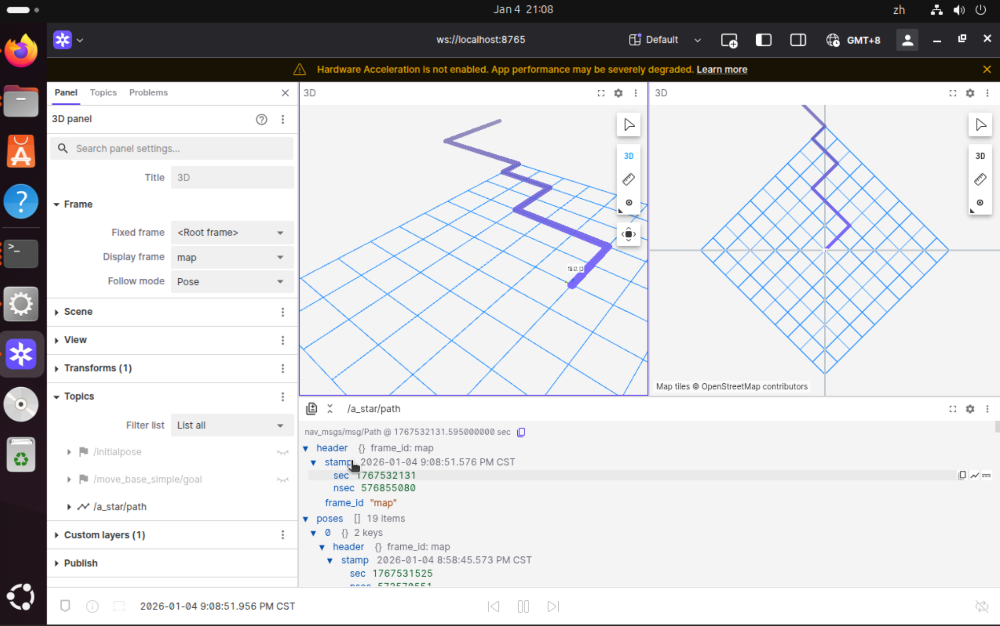

# A* demo (ROS 2 Jazzy + Foxglove)最短路径问题解决程序demo

## 前言
这次离散作业主题是最短路径问题。我接触之初还没学图论，遂查找了一系列如Dijkstra等算法，发现其实实现很简单，并且彼时恰好在  
做机器人导航的相关工作，向相关的人请教之后得知一个常用的算法就是A*，遂打算以A*为例子，并且配合我们使用的ROS环境做个示例,来使得这份工作更具意义。    
然而想法很好，过程相当坎坷。A*的demo早早就完成，但是学习ROS的foxglove等标准导航可视化工具花了挺久，期间很是忙碌，直到现在来不及才堪堪赶完。  
以至于Word都来不及制作，只能以markdown格式表示，多多见谅....(呜呜)
## 问题
最短路径问题，也就是需要寻找一条路径。一般来说这种情况下是存在阻碍，也就是不可达的地点的。否则两点之间直线最短秒了（）  
为了将这个阻碍抽象的表达出来，我们需要一个地图，比如网格状的地图，每个格子表示一个坐标点，其可以表示该坐标格是否可以通行。
与离散数学的联系就在于，这个也是一个图，我们可以把网格视作一个无向图，格就是顶点，格之间可走的路径就是边。这个地图就相当于是一个标注了哪些顶点可达，哪些顶点不可达的矩阵，

## 解决思路
为了解决这个问题，我们需要知道起点和终点。我们知道，如果存在一条最短路径，那么路径上的任何一个点（这个图的子图）到终点肯定也是最短路径，并且这个点周围的邻接点，除了在最短路径上那个以外，绝对会比这个点离终点更远。即，我一直选择当前点距离终点最近的邻居点，然后寻找这个最近邻居点的最近邻居点，这样不断重复，最终肯定能沿着最近的路到达终点。当然，可能存在两个看起来到终点距离最短的点，甚至更多，这时我们就要将其记录下来，并且分别计算，直到达到终点。
A*算法需要知道两个代价，也就是到起点的距离和到终点的距离。

## 效果展示




## 目录
- `main.cpp`：原始单机示例。
- `a_star_demo/`：ROS 2 Jazzy 包（发布 `nav_msgs/Path`）。

## 快速使用（ROS 2 Jazzy）
```bash
# 建议在工作区 src 下放置本包，然后构建
cd ~/ros2_ws
colcon build --packages-select a_star_demo
source install/setup.bash

# 启动
ros2 launch a_star_demo a_star_demo.launch.py
```

参数（可在 launch 中改）：
- `start_x`, `start_y`: 起点索引
- `goal_x`, `goal_y`: 终点索引
- `frame_id`: 路径坐标系（默认 `map`）

话题：
- `/a_star/path` (`nav_msgs/Path`, 1-step transient local，相当于 latched)

## Foxglove Studio 可视化
1) 启动 `foxglove_bridge`（Jazzy）：`ros2 run foxglove_bridge foxglove_bridge --port 8765`
2) 打开 Foxglove Studio → Connections → Add → Foxglove WebSocket → `ws://localhost:8765`。
3) 订阅 `/a_star/path`，在 Scene 添加 Path 图层（frame 使用 `map`）。如需 TF，可用 `static_transform_publisher` 提供 `map -> base_link`。

## 说明
ROS 节点启动后立即规划并每秒重发一次路径；若起点或终点落在障碍或越界，会给出警告且不发布路径。
